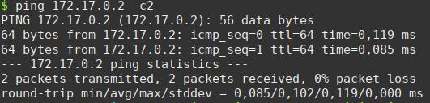
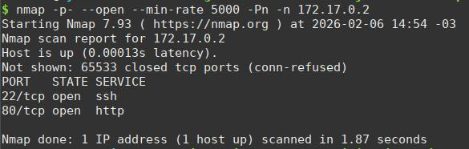
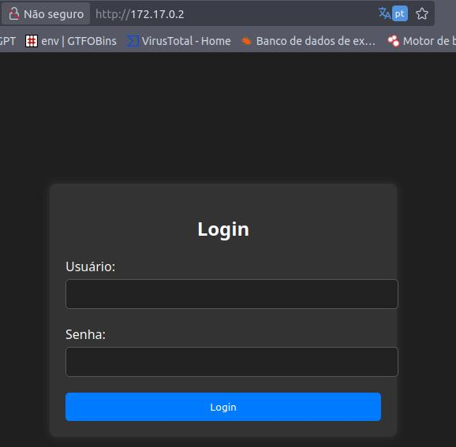
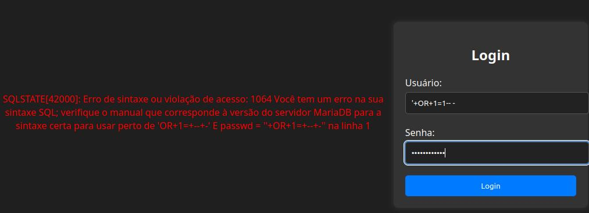
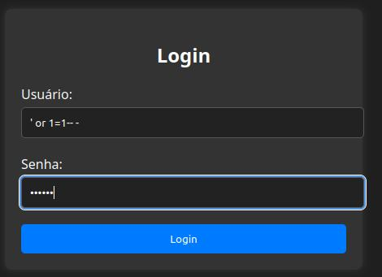
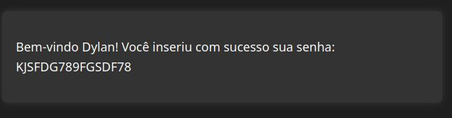
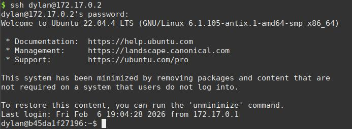
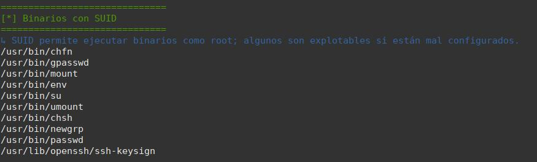
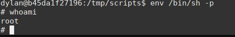

# Writeup DockerLabs – <Injection>

Este documento contiene el writeup del laboratorio **<injection>** de la plataforma **DockerLabs**.

El objetivo de este writeup es documentar el proceso seguido para comprometer el contenedor, detallando de forma clara y ordenada las técnicas utilizadas durante la resolución del laboratorio, con fines educativos y de aprendizaje en ciberseguridad.

---

Comenzaremos realizando un analisis del sistema vulnerable y descubirmos 2 servicios abiertos 22,80 (ssh - http )

perfecto es un panel de login, comenzaremos a forzar errores en la aplicacion con diferentes payloads

INJECCIONES SQL DETECTED

obtenemos un usuario dylan - password coneccion por sshal servidor como usuario dylan

Ejecutaremos nuestro script automatizado blue-eye de nuestro repositorio personal de github  o por medio de un http.server de python3 -m

Descubrimos un binario usr/bin/env posiblemente vulnerable

